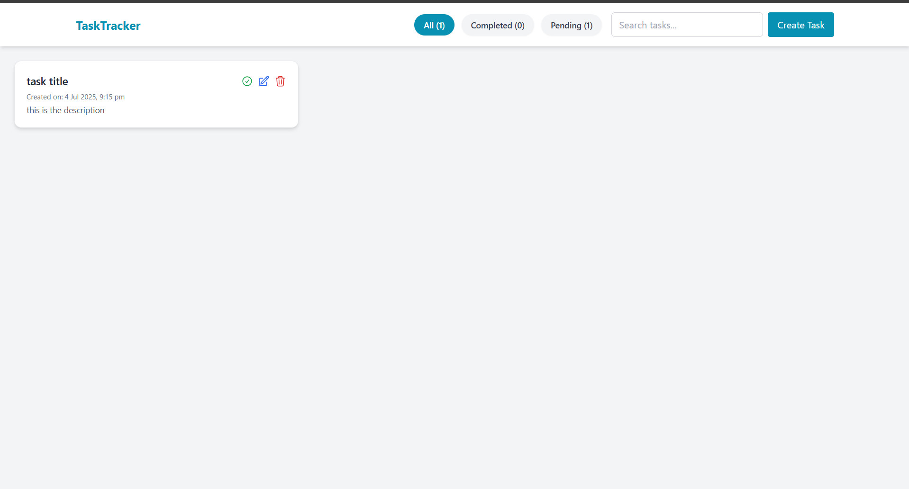
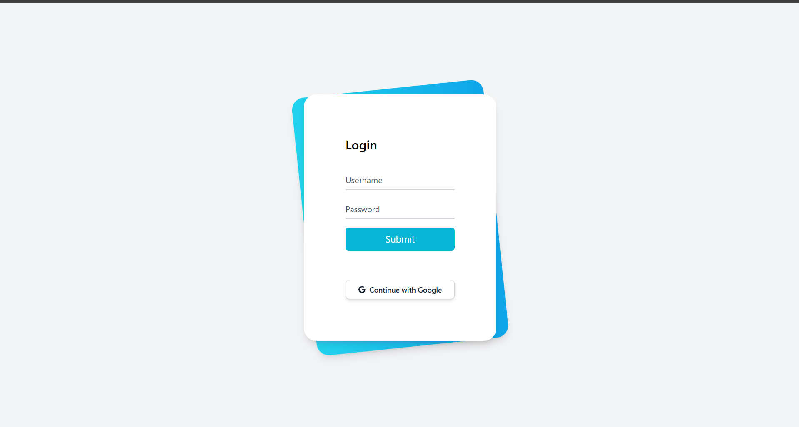

# 📝 Personal Task Tracker

## 📖 Description

A simple and elegant task management app built using React. It allows users to create, edit, delete, and filter personal tasks — all stored locally in the browser. Designed for fast, offline-first productivity.

## 🚀 Features

- Add new tasks with title and description
- View tasks as responsive cards
- Edit or delete existing tasks
- Mark tasks as completed
- Filter tasks (All / Completed / Pending)
- Search tasks by title or description
- Task creation timestamp
- Responsive layout using Tailwind CSS
- Smooth routing with React Router

---

## 🛠 Setup Instructions

1. **Clone the repository**
   ```bash
   git clone https://github.com/kundan6378/task-tracker.git
   cd task-tracker
   ```
2. **Install dependencies**

```bash
npm install
```

3. **Start the development server**

```bash
npm start
```

4. **Open your browser and go to:**
   http://localhost:3000

## 🔗 Live Demo

👉 [taskedpro.netlify.app](taskedpro.netlify.app)

## 🧰 Technologies Used

- React.js
- Tailwind CSS
- React Router DOM
- Font Awesome
- Local Storage API

## 🖼 Screenshots

📷 Screenshots of login and main page

### 🗂 Task List Page



### 📝 Login page


